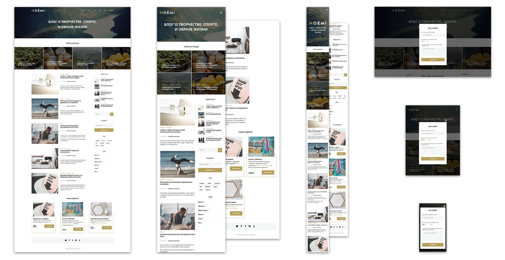

# Главная страница развлекательного сайта

## Стек технологий:
- HTML5
- CSS3
- Адаптивная и отзывчивая верстка
- Анимация на CSS
- Простейший JS

Данный проект разрабатывался в качестве курсовой работы на курсе "Адаптивная и мобильная верстка" в 2022 году.

В дальнейшем, по мере получения опыта верстки и работы с JS, я многое пересмотрела в нем.

## Важные доработки:
- Исправлены неточности семантической разметки.
- Пересмотрены наименования классов в соответствии с методологией БЭМ.
- Улучшена адаптивность изображений.
- Добавлена анимация CSS (подсветка кнопок при наведении, поведение модального окна при появлении).
- Добавлены элементы, реализуемые с помощью JS: меню-бургер, модальное окно (поп-ап).

Сайт доступен на хостинге [GitHub Pages](https://yuliyaatrashkevich.github.io/Diploma_HTML_CSS/).